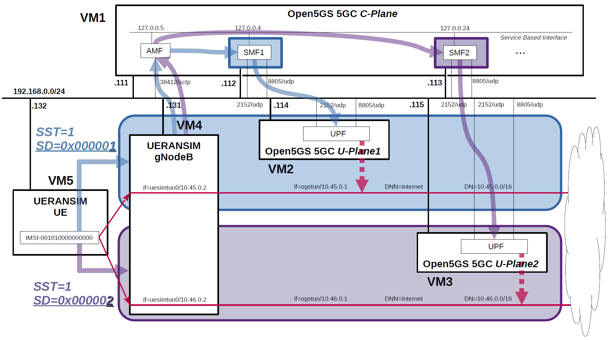

# Open5GS 5GC & UERANSIM UE / RAN Sample Configuration - Select UPF based on S-NSSAI
This describes a very simple configuration that uses Open5GS and UERANSIM to select the UPF based on S-NSSAI.

---

<h2 id="conf_list">List of Sample Configurations</h2>

1. [One SGW-C/PGW-C, Multiple SGW-Us/PGW-Us and APNs](https://github.com/s5uishida/open5gs_epc_oai_sample_config)
2. [One SMF, Multiple UPFs and DNNs](https://github.com/s5uishida/open5gs_5gc_ueransim_sample_config)
3. [Select nearby UPF according to the connected gNodeB](https://github.com/s5uishida/open5gs_5gc_ueransim_nearby_upf_sample_config)
4. Select UPF based on S-NSSAI (this article)
5. [SCP Indirect communication Model C](https://github.com/s5uishida/open5gs_5gc_ueransim_scp_model_c_sample_config)
6. [VoLTE and SMS Configuration for docker_open5gs](https://github.com/s5uishida/docker_open5gs_volte_sms_config)
7. [Monitoring Metrics with Prometheus](https://github.com/s5uishida/open5gs_5gc_ueransim_metrics_sample_config)
8. [Framed Routing](https://github.com/s5uishida/open5gs_5gc_ueransim_framed_routing_sample_config)
---

<h2 id="misc">Miscellaneous Notes</h2>

- [Install MongoDB 6.0 and Open5GS WebUI](https://github.com/s5uishida/open5gs_install_mongodb6_webui)
---

<h2 id="toc">Table of Contents</h2>

- [Overview of Open5GS 5GC Simulation Mobile Network](#overview)
- [Changes in configuration files of Open5GS 5GC and UERANSIM UE / RAN](#changes)
  - [Changes in configuration files of Open5GS 5GC C-Plane](#changes_cp)
  - [Changes in configuration files of Open5GS 5GC U-Plane1](#changes_up1)
  - [Changes in configuration files of Open5GS 5GC U-Plane2](#changes_up2)
  - [Changes in configuration files of UERANSIM UE / RAN](#changes_ueransim)
    - [Changes in configuration files of RAN (gNodeB)](#changes_ran)
    - [Changes in configuration files of UE[SST:1, SD:0x000001] (IMSI-001010000000000)](#changes_ue_sd1)
    - [Changes in configuration files of UE[SST:1, SD:0x000002] (IMSI-001010000000000)](#changes_ue_sd2)
- [Network settings of Open5GS 5GC and UERANSIM UE / RAN](#network_settings)
  - [Network settings of Open5GS 5GC C-Plane](#network_settings_cp)
  - [Network settings of Open5GS 5GC U-Plane1](#network_settings_up1)
  - [Network settings of Open5GS 5GC U-Plane2](#network_settings_up2)
- [Build Open5GS and UERANSIM](#build)
- [Run Open5GS 5GC and UERANSIM UE / RAN](#run)
  - [Run Open5GS 5GC C-Plane](#run_cp)
  - [Run Open5GS 5GC U-Plane1 & U-Plane2](#run_up)
  - [Run UERANSIM (gNodeB)](#run_ran)
  - [Run UERANSIM (UE[SST:1, SD:0x000001])](#run_sd1)
    - [UE connects to U-Plane1 based on SST:1 and SD:0x000001](#con_sd1)
    - [Ping google.com going through DN=10.45.0.0/16 on U-Plane1](#ping_sd1)
  - [Run UERANSIM (UE[SST:1, SD:0x000002])](#run_sd2)
    - [UE connects to U-Plane2 based on SST:1 and SD:0x000002](#con_sd2)
    - [Ping google.com going through DN=10.46.0.0/16 on U-Plane2](#ping_sd2)
- [Changelog (summary)](#changelog)

---
<h2 id="overview">Overview of Open5GS 5GC Simulation Mobile Network</h2>

The following minimum configuration was set as a condition.
- The UE selects a pair of SMF and UPF based on S-NSSAI.

The built simulation environment is as follows.

</img>

The 5GC / UE / RAN used are as follows.
- 5GC - Open5GS v2.6.1 (2023.03.18) - https://github.com/open5gs/open5gs
- UE / RAN - UERANSIM v3.2.6 (2023.03.17) - https://github.com/aligungr/UERANSIM

Each VMs are as follows.  
| VM # | SW & Role | IP address | OS | Memory (Min) | HDD (Min) |
| --- | --- | --- | --- | --- | --- |
| VM1 | Open5GS 5GC C-Plane | 192.168.0.111/24 <br> 192.168.0.112/24 <br> 192.168.0.113/24 | Ubuntu 22.04 | 1GB | 20GB |
| VM2 | Open5GS 5GC U-Plane1  | 192.168.0.114/24 | Ubuntu 22.04 | 1GB | 20GB |
| VM3 | Open5GS 5GC U-Plane2  | 192.168.0.115/24 | Ubuntu 22.04 | 1GB | 20GB |
| VM4 | UERANSIM RAN (gNodeB) | 192.168.0.131/24 | Ubuntu 22.04 | 1GB | 10GB |
| VM5 | UERANSIM UE | 192.168.0.132/24 | Ubuntu 22.04 | 1GB | 10GB |

AMF & SMF addresses are as follows.  
| NF | IP address | IP address on SBI | Supported S-NSSAI |
| --- | --- | --- | --- |
| AMF | 192.168.0.111 | 127.0.0.5 | SST:1, SD:0x000001 <br> SST:1, SD:0x000002 |
| SMF1 | 192.168.0.112 | 127.0.0.4 | SST:1, SD:0x000001 |
| SMF2 | 192.168.0.113 | 127.0.0.24 | SST:1, SD:0x000002 |

gNodeB Information (other information is default) is as follows.  
| IP address | Supported S-NSSAI |
| --- | --- |
| 192.168.0.131 | SST:1, SD:0x000001 <br> SST:1, SD:0x000002 |

Subscriber Information (other information is default) is as follows.  
**Note. Please select OP or OPc according to the setting of UERANSIM UE configuration files.**
| UE | IMSI | DNN | OP/OPc | S-NSSAI |
| --- | --- | --- | --- | --- |
| UE | 001010000000000 | internet | OPc | SST:1, SD:0x000001 <br> SST:1, SD:0x000002|

I registered these information with the Open5GS WebUI.
In addition, [3GPP TS 35.208](https://www.3gpp.org/DynaReport/35208.htm) "4.3 Test Sets" is published by 3GPP as test data for the 3GPP authentication and key generation functions (MILENAGE).

Each DNs are as follows.
| DN | S-NSSAI |  TUNnel interface of DN | DNN | TUNnel interface of UE | U-Plane # |
| --- | --- | --- | --- | --- | --- |
| 10.45.0.0/16 | SST:1 <br> SD:0x000001 | ogstun | internet | uesimtun0 | U-Plane1 |
| 10.46.0.0/16 | SST:1 <br> SD:0x000002 | ogstun | internet | uesimtun1 | U-Plane2 |

<h2 id="changes">Changes in configuration files of Open5GS 5GC and UERANSIM UE / RAN</h2>

Please refer to the following for building Open5GS and UERANSIM respectively.
- Open5GS v2.6.1 (2023.03.18) - https://open5gs.org/open5gs/docs/guide/02-building-open5gs-from-sources/
- UERANSIM v3.2.6 (2023.03.17) - https://github.com/aligungr/UERANSIM/wiki/Installation

<h3 id="changes_cp">Changes in configuration files of Open5GS 5GC C-Plane</h3>

- `open5gs/install/etc/open5gs/amf.yaml`
```diff
--- amf.yaml.orig       2023-02-18 16:56:58.000000000 +0900
+++ amf.yaml    2023-02-18 17:53:50.000000000 +0900
@@ -416,28 +416,31 @@
       - addr: 127.0.0.5
         port: 7777
     ngap:
-      - addr: 127.0.0.5
+      - addr: 192.168.0.111
     metrics:
       - addr: 127.0.0.5
         port: 9090
     guami:
       - plmn_id:
-          mcc: 999
-          mnc: 70
+          mcc: 001
+          mnc: 01
         amf_id:
           region: 2
           set: 1
     tai:
       - plmn_id:
-          mcc: 999
-          mnc: 70
+          mcc: 001
+          mnc: 01
         tac: 1
     plmn_support:
       - plmn_id:
-          mcc: 999
-          mnc: 70
+          mcc: 001
+          mnc: 01
         s_nssai:
           - sst: 1
+            sd: 000001
+          - sst: 1
+            sd: 000002
     security:
         integrity_order : [ NIA2, NIA1, NIA0 ]
         ciphering_order : [ NEA0, NEA1, NEA2 ]
```
- `open5gs/install/etc/open5gs/smf1.yaml`
```diff
--- smf.yaml.orig       2023-03-10 21:49:28.000000000 +0900
+++ smf1.yaml   2023-03-11 17:42:14.000000000 +0900
@@ -20,7 +20,7 @@
 #    domain: core,sbi,ausf,event,tlv,mem,sock
 #
 logger:
-    file: /root/open5gs/install/var/log/open5gs/smf.log
+    file: /root/open5gs/install/var/log/open5gs/smf1.log
 
 #
 #  o TLS enable/disable
@@ -602,20 +602,17 @@
       - addr: 127.0.0.4
         port: 7777
     pfcp:
-      - addr: 127.0.0.4
-      - addr: ::1
+      - addr: 192.168.0.112
     gtpc:
       - addr: 127.0.0.4
-      - addr: ::1
     gtpu:
-      - addr: 127.0.0.4
-      - addr: ::1
+      - addr: 192.168.0.112
     metrics:
       - addr: 127.0.0.4
         port: 9090
     subnet:
       - addr: 10.45.0.1/16
-      - addr: 2001:db8:cafe::1/48
+        dnn: internet
     dns:
       - 8.8.8.8
       - 8.8.4.4
@@ -624,7 +621,18 @@
     mtu: 1400
     ctf:
       enabled: auto
-    freeDiameter: /root/open5gs/install/etc/freeDiameter/smf.conf
+    freeDiameter: /root/open5gs/install/etc/freeDiameter/smf1.conf
+    info:
+      - s_nssai:
+          - sst: 1
+            sd: 000001
+            dnn:
+              - internet
+        tai:
+          - plmn_id:
+              mcc: 001
+              mnc: 01
+            tac: 1
 
 #
 #  <SBI Client>>
@@ -813,7 +821,8 @@
 #
 upf:
     pfcp:
-      - addr: 127.0.0.7
+      - addr: 192.168.0.114
+        dnn: internet
 
 #
 #  o Disable use of IPv4 addresses (only IPv6)
```
- `open5gs/install/etc/open5gs/smf2.yaml`
```diff
--- smf.yaml.orig       2023-03-10 21:49:28.000000000 +0900
+++ smf2.yaml   2023-03-17 21:10:44.184592280 +0900
@@ -20,7 +20,7 @@
 #    domain: core,sbi,ausf,event,tlv,mem,sock
 #
 logger:
-    file: /root/open5gs/install/var/log/open5gs/smf.log
+    file: /root/open5gs/install/var/log/open5gs/smf2.log
 
 #
 #  o TLS enable/disable
@@ -599,23 +599,20 @@
 #
 smf:
     sbi:
-      - addr: 127.0.0.4
+      - addr: 127.0.0.24
         port: 7777
     pfcp:
-      - addr: 127.0.0.4
-      - addr: ::1
+      - addr: 192.168.0.113
     gtpc:
-      - addr: 127.0.0.4
-      - addr: ::1
+      - addr: 127.0.0.24
     gtpu:
-      - addr: 127.0.0.4
-      - addr: ::1
+      - addr: 192.168.0.113
     metrics:
-      - addr: 127.0.0.4
+      - addr: 127.0.0.24
         port: 9090
     subnet:
-      - addr: 10.45.0.1/16
-      - addr: 2001:db8:cafe::1/48
+      - addr: 10.46.0.1/16
+        dnn: internet
     dns:
       - 8.8.8.8
       - 8.8.4.4
@@ -624,7 +621,18 @@
     mtu: 1400
     ctf:
       enabled: auto
-    freeDiameter: /root/open5gs/install/etc/freeDiameter/smf.conf
+    freeDiameter: /root/open5gs/install/etc/freeDiameter/smf2.conf
+    info:
+      - s_nssai:
+          - sst: 1
+            sd: 000002
+            dnn:
+              - internet
+        tai:
+          - plmn_id:
+              mcc: 001
+              mnc: 01
+            tac: 1
 
 #
 #  <SBI Client>>
@@ -813,7 +821,8 @@
 #
 upf:
     pfcp:
-      - addr: 127.0.0.7
+      - addr: 192.168.0.115
+        dnn: internet
 
 #
 #  o Disable use of IPv4 addresses (only IPv6)
```
- `open5gs/install/etc/open5gs/nssf.yaml`
```diff
--- nssf.yaml.orig      2023-02-18 16:56:58.000000000 +0900
+++ nssf.yaml   2023-02-18 17:54:48.000000000 +0900
@@ -313,6 +313,12 @@
         port: 7777
         s_nssai:
           sst: 1
+          sd: 000001
+      - addr: 127.0.0.10
+        port: 7777
+        s_nssai:
+          sst: 1
+          sd: 000002
 
 #
 #  <SBI Client>>
```
- `open5gs/install/etc/freeDiameter/smf1.conf`  
`smf1.conf` is equal to the original `smf.conf`.

- `open5gs/install/etc/freeDiameter/smf2.conf`
```diff
--- smf.conf.orig       2023-01-12 20:33:20.131297687 +0900
+++ smf2.conf   2023-01-12 22:22:40.352706816 +0900
@@ -79,7 +79,7 @@
 #ListenOn = "202.249.37.5";
 #ListenOn = "2001:200:903:2::202:1";
 #ListenOn = "fe80::21c:5ff:fe98:7d62%eth0";
-ListenOn = "127.0.0.4";
+ListenOn = "127.0.0.24";
 
 
 ##############################################################
```

<h3 id="changes_up1">Changes in configuration files of Open5GS 5GC U-Plane1</h3>

- `open5gs/install/etc/open5gs/upf.yaml`
```diff
--- upf.yaml.orig       2023-03-02 22:07:32.000000000 +0900
+++ upf.yaml    2023-03-11 17:45:02.000000000 +0900
@@ -196,12 +196,13 @@
 #
 upf:
     pfcp:
-      - addr: 127.0.0.7
+      - addr: 192.168.0.114
     gtpu:
-      - addr: 127.0.0.7
+      - addr: 192.168.0.114
     subnet:
       - addr: 10.45.0.1/16
-      - addr: 2001:db8:cafe::1/48
+        dnn: internet
+        dev: ogstun
     metrics:
       - addr: 127.0.0.7
         port: 9090
```

<h3 id="changes_up2">Changes in configuration files of Open5GS 5GC U-Plane2</h3>

- `open5gs/install/etc/open5gs/upf.yaml`
```diff
--- upf.yaml.orig       2023-03-02 22:18:20.000000000 +0900
+++ upf.yaml    2023-03-11 17:46:06.000000000 +0900
@@ -196,12 +196,13 @@
 #
 upf:
     pfcp:
-      - addr: 127.0.0.7
+      - addr: 192.168.0.115
     gtpu:
-      - addr: 127.0.0.7
+      - addr: 192.168.0.115
     subnet:
-      - addr: 10.45.0.1/16
-      - addr: 2001:db8:cafe::1/48
+      - addr: 10.46.0.1/16
+        dnn: internet
+        dev: ogstun
     metrics:
       - addr: 127.0.0.7
         port: 9090
```

<h3 id="changes_ueransim">Changes in configuration files of UERANSIM UE / RAN</h3>

<h4 id="changes_ran">Changes in configuration files of RAN (gNodeB)</h4>

- `UERANSIM/config/open5gs-gnb.yaml`
```diff
--- open5gs-gnb.yaml.orig       2022-07-03 13:06:43.000000000 +0900
+++ open5gs-gnb.yaml    2023-01-12 23:39:36.000000000 +0900
@@ -1,22 +1,25 @@
-mcc: '999'          # Mobile Country Code value
-mnc: '70'           # Mobile Network Code value (2 or 3 digits)
+mcc: '001'          # Mobile Country Code value
+mnc: '01'           # Mobile Network Code value (2 or 3 digits)
 
 nci: '0x000000010'  # NR Cell Identity (36-bit)
 idLength: 32        # NR gNB ID length in bits [22...32]
 tac: 1              # Tracking Area Code
 
-linkIp: 127.0.0.1   # gNB's local IP address for Radio Link Simulation (Usually same with local IP)
-ngapIp: 127.0.0.1   # gNB's local IP address for N2 Interface (Usually same with local IP)
-gtpIp: 127.0.0.1    # gNB's local IP address for N3 Interface (Usually same with local IP)
+linkIp: 192.168.0.131   # gNB's local IP address for Radio Link Simulation (Usually same with local IP)
+ngapIp: 192.168.0.131   # gNB's local IP address for N2 Interface (Usually same with local IP)
+gtpIp: 192.168.0.131    # gNB's local IP address for N3 Interface (Usually same with local IP)
 
 # List of AMF address information
 amfConfigs:
-  - address: 127.0.0.5
+  - address: 192.168.0.111
     port: 38412
 
 # List of supported S-NSSAIs by this gNB
 slices:
   - sst: 1
+    sd: 0x000001
+  - sst: 1
+    sd: 0x000002
 
 # Indicates whether or not SCTP stream number errors should be ignored.
 ignoreStreamIds: true
```

<h4 id="changes_ue_sd1">Changes in configuration files of UE[SST:1, SD:0x000001] (IMSI-001010000000000)</h4>

- `UERANSIM/config/open5gs-ue-sd1.yaml`
```diff
--- open5gs-ue.yaml.orig        2023-03-17 19:17:14.000000000 +0900
+++ open5gs-ue-sd1.yaml 2023-03-18 18:11:17.083028852 +0900
@@ -1,9 +1,9 @@
 # IMSI number of the UE. IMSI = [MCC|MNC|MSISDN] (In total 15 digits)
-supi: 'imsi-999700000000001'
+supi: 'imsi-001010000000000'
 # Mobile Country Code value of HPLMN
-mcc: '999'
+mcc: '001'
 # Mobile Network Code value of HPLMN (2 or 3 digits)
-mnc: '70'
+mnc: '01'
 # Routing Indicator
 routingIndicator: '0000'
 
@@ -22,7 +22,7 @@
 
 # List of gNB IP addresses for Radio Link Simulation
 gnbSearchList:
-  - 127.0.0.1
+  - 192.168.0.131
 
 # UAC Access Identities Configuration
 uacAic:
@@ -44,15 +44,17 @@
     apn: 'internet'
     slice:
       sst: 1
+      sd: 0x000001
 
 # Configured NSSAI for this UE by HPLMN
 configured-nssai:
   - sst: 1
+    sd: 0x000001
 
 # Default Configured NSSAI for this UE
 default-nssai:
   - sst: 1
-    sd: 1
+    sd: 0x000001
 
 # Supported integrity algorithms by this UE
 integrity:
```

<h4 id="changes_ue_sd2">Changes in configuration files of UE[SST:1, SD:0x000002] (IMSI-001010000000000)</h4>

- `UERANSIM/config/open5gs-ue-sd2.yaml`
```diff
--- open5gs-ue.yaml.orig        2023-03-17 19:17:14.000000000 +0900
+++ open5gs-ue-sd2.yaml 2023-03-18 18:11:23.769956928 +0900
@@ -1,9 +1,9 @@
 # IMSI number of the UE. IMSI = [MCC|MNC|MSISDN] (In total 15 digits)
-supi: 'imsi-999700000000001'
+supi: 'imsi-001010000000000'
 # Mobile Country Code value of HPLMN
-mcc: '999'
+mcc: '001'
 # Mobile Network Code value of HPLMN (2 or 3 digits)
-mnc: '70'
+mnc: '01'
 # Routing Indicator
 routingIndicator: '0000'
 
@@ -22,7 +22,7 @@
 
 # List of gNB IP addresses for Radio Link Simulation
 gnbSearchList:
-  - 127.0.0.1
+  - 192.168.0.131
 
 # UAC Access Identities Configuration
 uacAic:
@@ -44,15 +44,17 @@
     apn: 'internet'
     slice:
       sst: 1
+      sd: 0x000002
 
 # Configured NSSAI for this UE by HPLMN
 configured-nssai:
   - sst: 1
+    sd: 0x000002
 
 # Default Configured NSSAI for this UE
 default-nssai:
   - sst: 1
-    sd: 1
+    sd: 0x000002
 
 # Supported integrity algorithms by this UE
 integrity:
```

<h2 id="network_settings">Network settings of Open5GS 5GC and UERANSIM UE / RAN</h2>

<h3 id="network_settings_cp">Network settings of Open5GS 5GC C-Plane</h3>

Add IP addresses for SMF1 and SMF2.
```
ip addr add 192.168.0.112/24 dev enp0s8
ip addr add 192.168.0.113/24 dev enp0s8
```
**Note. `enp0s8` is the network interface of `192.168.0.0/24` in my VirtualBox environment.
Please change it according to your environment.**

<h3 id="network_settings_up1">Network settings of Open5GS 5GC U-Plane1</h3>

First, uncomment the next line in the `/etc/sysctl.conf` file and reflect it in the OS.
```
net.ipv4.ip_forward=1
```
```
# sysctl -p
```
Next, configure the TUNnel interface and NAPT.
```
ip tuntap add name ogstun mode tun
ip addr add 10.45.0.1/16 dev ogstun
ip link set ogstun up

iptables -t nat -A POSTROUTING -s 10.45.0.0/16 ! -o ogstun -j MASQUERADE
```

<h3 id="network_settings_up2">Network settings of Open5GS 5GC U-Plane2</h3>

First, uncomment the next line in the `/etc/sysctl.conf` file and reflect it in the OS.
```
net.ipv4.ip_forward=1
```
```
# sysctl -p
```
Next, configure the TUNnel interface and NAPT.
```
ip tuntap add name ogstun mode tun
ip addr add 10.46.0.1/16 dev ogstun
ip link set ogstun up

iptables -t nat -A POSTROUTING -s 10.46.0.0/16 ! -o ogstun -j MASQUERADE
```

<h2 id="build">Build Open5GS and UERANSIM</h2>

Please refer to the following for building Open5GS and UERANSIM respectively.
- Open5GS v2.6.1 (2023.03.18) - https://open5gs.org/open5gs/docs/guide/02-building-open5gs-from-sources/
- UERANSIM v3.2.6 (2023.03.17) - https://github.com/aligungr/UERANSIM/wiki/Installation

Install MongoDB on Open5GS 5GC C-Plane machine.
It is not necessary to install MongoDB on Open5GS 5GC U-Plane machines.
[MongoDB Compass](https://www.mongodb.com/products/compass) is a convenient tool to look at the MongoDB database.

<h2 id="run">Run Open5GS 5GC and UERANSIM UE / RAN</h2>

First run the 5GC, then UERANSIM (UE & RAN implementation).

<h3 id="run_cp">Run Open5GS 5GC C-Plane</h3>

First, run Open5GS 5GC C-Plane.

- Open5GS 5GC C-Plane
```
./install/bin/open5gs-nrfd &
sleep 5
./install/bin/open5gs-scpd &
sleep 5
./install/bin/open5gs-smfd -c install/etc/open5gs/smf1.yaml &
./install/bin/open5gs-smfd -c install/etc/open5gs/smf2.yaml &
./install/bin/open5gs-amfd &
./install/bin/open5gs-ausfd &
./install/bin/open5gs-udmd &
./install/bin/open5gs-udrd &
./install/bin/open5gs-pcfd &
./install/bin/open5gs-nssfd &
./install/bin/open5gs-bsfd &
```

<h3 id="run_up">Run Open5GS 5GC U-Plane1 & U-Plane2</h3>

Next, run Open5GS 5GC U-Plane.

- Open5GS 5GC U-Plane1
```
./install/bin/open5gs-upfd &
```
- Open5GS 5GC U-Plane2
```
./install/bin/open5gs-upfd &
```
Then run `tcpdump` on one more terminal for each U-Plane.
- Run `tcpdump` on VM2 (U-Plane1)
```
# tcpdump -i ogstun -n
tcpdump: verbose output suppressed, use -v or -vv for full protocol decode
listening on ogstun, link-type RAW (Raw IP), capture size 262144 bytes
```
- Run `tcpdump` on VM3 (U-Plane2)
```
# tcpdump -i ogstun -n
tcpdump: verbose output suppressed, use -v or -vv for full protocol decode
listening on ogstun, link-type RAW (Raw IP), capture size 262144 bytes
```

<h3 id="run_ran">Run UERANSIM (gNodeB)</h3>

Please refer to the following for usage of UERANSIM.

https://github.com/aligungr/UERANSIM/wiki/Usage

```
# ./nr-gnb -c ../config/open5gs-gnb.yaml
UERANSIM v3.2.6
[2023-03-18 18:31:05.057] [sctp] [info] Trying to establish SCTP connection... (192.168.0.111:38412)
[2023-03-18 18:31:05.060] [sctp] [info] SCTP connection established (192.168.0.111:38412)
[2023-03-18 18:31:05.060] [sctp] [debug] SCTP association setup ascId[6]
[2023-03-18 18:31:05.060] [ngap] [debug] Sending NG Setup Request
[2023-03-18 18:31:05.061] [ngap] [debug] NG Setup Response received
[2023-03-18 18:31:05.061] [ngap] [info] NG Setup procedure is successful
```
The Open5GS C-Plane log when executed is as follows.
```
03/18 18:31:05.062: [amf] INFO: gNB-N2 accepted[192.168.0.131]:53261 in ng-path module (../src/amf/ngap-sctp.c:113)
03/18 18:31:05.062: [amf] INFO: gNB-N2 accepted[192.168.0.131] in master_sm module (../src/amf/amf-sm.c:733)
03/18 18:31:05.062: [amf] INFO: [Added] Number of gNBs is now 1 (../src/amf/context.c:1034)
03/18 18:31:05.062: [amf] INFO: gNB-N2[192.168.0.131] max_num_of_ostreams : 10 (../src/amf/amf-sm.c:772)
```

<h3 id="run_sd1">Run UERANSIM (UE[SST:1, SD:0x000001])</h3>

Confirm that the packet goes through the DN of U-Plane1 based on SST:1 and SD:0x000001.

<h4 id="con_sd1">UE connects to U-Plane1 based on SST:1 and SD:0x000001</h4>

```
# ./nr-ue -c ../config/open5gs-ue-sd1.yaml 
UERANSIM v3.2.6
[2023-03-18 18:36:26.233] [nas] [info] UE switches to state [MM-DEREGISTERED/PLMN-SEARCH]
[2023-03-18 18:36:26.234] [rrc] [debug] New signal detected for cell[1], total [1] cells in coverage
[2023-03-18 18:36:26.235] [nas] [info] Selected plmn[001/01]
[2023-03-18 18:36:26.235] [rrc] [info] Selected cell plmn[001/01] tac[1] category[SUITABLE]
[2023-03-18 18:36:26.235] [nas] [info] UE switches to state [MM-DEREGISTERED/PS]
[2023-03-18 18:36:26.236] [nas] [info] UE switches to state [MM-DEREGISTERED/NORMAL-SERVICE]
[2023-03-18 18:36:26.236] [nas] [debug] Initial registration required due to [MM-DEREG-NORMAL-SERVICE]
[2023-03-18 18:36:26.238] [nas] [debug] UAC access attempt is allowed for identity[0], category[MO_sig]
[2023-03-18 18:36:26.238] [nas] [debug] Sending Initial Registration
[2023-03-18 18:36:26.238] [rrc] [debug] Sending RRC Setup Request
[2023-03-18 18:36:26.239] [nas] [info] UE switches to state [MM-REGISTER-INITIATED]
[2023-03-18 18:36:26.239] [rrc] [info] RRC connection established
[2023-03-18 18:36:26.239] [rrc] [info] UE switches to state [RRC-CONNECTED]
[2023-03-18 18:36:26.239] [nas] [info] UE switches to state [CM-CONNECTED]
[2023-03-18 18:36:26.249] [nas] [debug] Authentication Request received
[2023-03-18 18:36:26.257] [nas] [debug] Security Mode Command received
[2023-03-18 18:36:26.257] [nas] [debug] Selected integrity[2] ciphering[0]
[2023-03-18 18:36:26.277] [nas] [debug] Registration accept received
[2023-03-18 18:36:26.278] [nas] [info] UE switches to state [MM-REGISTERED/NORMAL-SERVICE]
[2023-03-18 18:36:26.278] [nas] [debug] Sending Registration Complete
[2023-03-18 18:36:26.278] [nas] [info] Initial Registration is successful
[2023-03-18 18:36:26.278] [nas] [debug] Sending PDU Session Establishment Request
[2023-03-18 18:36:26.278] [nas] [debug] UAC access attempt is allowed for identity[0], category[MO_sig]
[2023-03-18 18:36:26.482] [nas] [debug] Configuration Update Command received
[2023-03-18 18:36:26.505] [nas] [debug] PDU Session Establishment Accept received
[2023-03-18 18:36:26.508] [nas] [info] PDU Session establishment is successful PSI[1]
[2023-03-18 18:36:26.537] [app] [info] Connection setup for PDU session[1] is successful, TUN interface[uesimtun0, 10.45.0.2] is up.
```
The Open5GS C-Plane log when executed is as follows.
```
03/18 18:36:26.247: [amf] INFO: InitialUEMessage (../src/amf/ngap-handler.c:372)
03/18 18:36:26.247: [amf] INFO: [Added] Number of gNB-UEs is now 1 (../src/amf/context.c:2327)
03/18 18:36:26.247: [amf] INFO:     RAN_UE_NGAP_ID[1] AMF_UE_NGAP_ID[1] TAC[1] CellID[0x10] (../src/amf/ngap-handler.c:533)
03/18 18:36:26.247: [amf] INFO: [suci-0-001-01-0000-0-0-0000000000] Unknown UE by SUCI (../src/amf/context.c:1634)
03/18 18:36:26.247: [amf] INFO: [Added] Number of AMF-UEs is now 1 (../src/amf/context.c:1419)
03/18 18:36:26.247: [gmm] INFO: Registration request (../src/amf/gmm-sm.c:985)
03/18 18:36:26.247: [gmm] INFO: [suci-0-001-01-0000-0-0-0000000000]    SUCI (../src/amf/gmm-handler.c:149)
03/18 18:36:26.248: [sbi] WARNING: [9302d02a-c56f-41ed-9e7f-19d339c774dc] (NF-discover) NF has already been added (../lib/sbi/nnrf-handler.c:839)
03/18 18:36:26.249: [sbi] WARNING: NF EndPoint updated [127.0.0.11:80] (../lib/sbi/context.c:1618)
03/18 18:36:26.249: [sbi] WARNING: NF EndPoint updated [127.0.0.11:7777] (../lib/sbi/context.c:1527)
03/18 18:36:26.249: [sbi] INFO: [9302d02a-c56f-41ed-9e7f-19d339c774dc] (NF-discover) NF Profile updated (../lib/sbi/nnrf-handler.c:862)
03/18 18:36:26.250: [sbi] WARNING: [930336dc-c56f-41ed-8ec2-99e4d7fea96d] (NF-discover) NF has already been added (../lib/sbi/nnrf-handler.c:839)
03/18 18:36:26.250: [sbi] WARNING: NF EndPoint updated [127.0.0.12:80] (../lib/sbi/context.c:1618)
03/18 18:36:26.251: [sbi] WARNING: NF EndPoint updated [127.0.0.12:7777] (../lib/sbi/context.c:1527)
03/18 18:36:26.251: [sbi] WARNING: NF EndPoint updated [127.0.0.12:7777] (../lib/sbi/context.c:1527)
03/18 18:36:26.251: [sbi] WARNING: NF EndPoint updated [127.0.0.12:7777] (../lib/sbi/context.c:1527)
03/18 18:36:26.251: [sbi] INFO: [930336dc-c56f-41ed-8ec2-99e4d7fea96d] (NF-discover) NF Profile updated (../lib/sbi/nnrf-handler.c:862)
03/18 18:36:26.266: [sbi] WARNING: [930336dc-c56f-41ed-8ec2-99e4d7fea96d] (NF-discover) NF has already been added (../lib/sbi/nnrf-handler.c:839)
03/18 18:36:26.267: [sbi] WARNING: NF EndPoint updated [127.0.0.12:80] (../lib/sbi/context.c:1618)
03/18 18:36:26.267: [sbi] WARNING: NF EndPoint updated [127.0.0.12:7777] (../lib/sbi/context.c:1527)
03/18 18:36:26.267: [sbi] WARNING: NF EndPoint updated [127.0.0.12:7777] (../lib/sbi/context.c:1527)
03/18 18:36:26.267: [sbi] WARNING: NF EndPoint updated [127.0.0.12:7777] (../lib/sbi/context.c:1527)
03/18 18:36:26.267: [sbi] INFO: [930336dc-c56f-41ed-8ec2-99e4d7fea96d] (NF-discover) NF Profile updated (../lib/sbi/nnrf-handler.c:862)
03/18 18:36:26.270: [sbi] WARNING: [930336dc-c56f-41ed-8ec2-99e4d7fea96d] (NF-discover) NF has already been added (../lib/sbi/nnrf-handler.c:839)
03/18 18:36:26.270: [sbi] WARNING: NF EndPoint updated [127.0.0.12:80] (../lib/sbi/context.c:1618)
03/18 18:36:26.271: [sbi] WARNING: NF EndPoint updated [127.0.0.12:7777] (../lib/sbi/context.c:1527)
03/18 18:36:26.271: [sbi] WARNING: NF EndPoint updated [127.0.0.12:7777] (../lib/sbi/context.c:1527)
03/18 18:36:26.271: [sbi] WARNING: NF EndPoint updated [127.0.0.12:7777] (../lib/sbi/context.c:1527)
03/18 18:36:26.271: [sbi] INFO: [930336dc-c56f-41ed-8ec2-99e4d7fea96d] (NF-discover) NF Profile updated (../lib/sbi/nnrf-handler.c:862)
03/18 18:36:26.278: [sbi] WARNING: [930b3c88-c56f-41ed-a613-a1f4abd59bcf] (NF-discover) NF has already been added (../lib/sbi/nnrf-handler.c:839)
03/18 18:36:26.278: [sbi] WARNING: NF EndPoint updated [127.0.0.13:80] (../lib/sbi/context.c:1618)
03/18 18:36:26.279: [sbi] WARNING: NF EndPoint updated [127.0.0.13:7777] (../lib/sbi/context.c:1527)
03/18 18:36:26.279: [sbi] WARNING: NF EndPoint updated [127.0.0.13:7777] (../lib/sbi/context.c:1527)
03/18 18:36:26.279: [sbi] WARNING: NF EndPoint updated [127.0.0.13:7777] (../lib/sbi/context.c:1527)
03/18 18:36:26.279: [sbi] INFO: [930b3c88-c56f-41ed-a613-a1f4abd59bcf] (NF-discover) NF Profile updated (../lib/sbi/nnrf-handler.c:862)
03/18 18:36:26.281: [sbi] WARNING: [930b9886-c56f-41ed-bfe8-971da2896416] (NF-discover) NF has already been added (../lib/sbi/nnrf-handler.c:839)
03/18 18:36:26.281: [sbi] WARNING: NF EndPoint updated [127.0.0.20:80] (../lib/sbi/context.c:1618)
03/18 18:36:26.282: [sbi] WARNING: NF EndPoint updated [127.0.0.20:7777] (../lib/sbi/context.c:1527)
03/18 18:36:26.282: [sbi] INFO: [930b9886-c56f-41ed-bfe8-971da2896416] (NF-discover) NF Profile updated (../lib/sbi/nnrf-handler.c:862)
03/18 18:36:26.486: [gmm] INFO: [imsi-001010000000000] Registration complete (../src/amf/gmm-sm.c:1917)
03/18 18:36:26.486: [amf] INFO: [imsi-001010000000000] Configuration update command (../src/amf/nas-path.c:612)
03/18 18:36:26.487: [gmm] INFO:     UTC [2023-03-18T09:36:26] Timezone[0]/DST[0] (../src/amf/gmm-build.c:545)
03/18 18:36:26.487: [gmm] INFO:     LOCAL [2023-03-18T18:36:26] Timezone[32400]/DST[0] (../src/amf/gmm-build.c:550)
03/18 18:36:26.489: [amf] INFO: [Added] Number of AMF-Sessions is now 1 (../src/amf/context.c:2348)
03/18 18:36:26.489: [gmm] INFO: UE SUPI[imsi-001010000000000] DNN[internet] S_NSSAI[SST:1 SD:0x1] (../src/amf/gmm-handler.c:1186)
03/18 18:36:26.492: [smf] INFO: [Added] Number of SMF-UEs is now 1 (../src/smf/context.c:1012)
03/18 18:36:26.493: [smf] INFO: [Added] Number of SMF-Sessions is now 1 (../src/smf/context.c:3108)
03/18 18:36:26.496: [sbi] WARNING: [930336dc-c56f-41ed-8ec2-99e4d7fea96d] (NF-discover) NF has already been added (../lib/sbi/nnrf-handler.c:839)
03/18 18:36:26.496: [sbi] WARNING: NF EndPoint updated [127.0.0.12:80] (../lib/sbi/context.c:1618)
03/18 18:36:26.496: [sbi] WARNING: NF EndPoint updated [127.0.0.12:7777] (../lib/sbi/context.c:1527)
03/18 18:36:26.496: [sbi] WARNING: NF EndPoint updated [127.0.0.12:7777] (../lib/sbi/context.c:1527)
03/18 18:36:26.496: [sbi] WARNING: NF EndPoint updated [127.0.0.12:7777] (../lib/sbi/context.c:1527)
03/18 18:36:26.496: [sbi] INFO: [930336dc-c56f-41ed-8ec2-99e4d7fea96d] (NF-discover) NF Profile updated (../lib/sbi/nnrf-handler.c:862)
03/18 18:36:26.500: [sbi] WARNING: [930b3c88-c56f-41ed-a613-a1f4abd59bcf] (NF-discover) NF has already been added (../lib/sbi/nnrf-handler.c:839)
03/18 18:36:26.500: [sbi] WARNING: NF EndPoint updated [127.0.0.13:80] (../lib/sbi/context.c:1618)
03/18 18:36:26.500: [sbi] WARNING: NF EndPoint updated [127.0.0.13:7777] (../lib/sbi/context.c:1527)
03/18 18:36:26.501: [sbi] WARNING: NF EndPoint updated [127.0.0.13:7777] (../lib/sbi/context.c:1527)
03/18 18:36:26.501: [sbi] WARNING: NF EndPoint updated [127.0.0.13:7777] (../lib/sbi/context.c:1527)
03/18 18:36:26.501: [sbi] INFO: [930b3c88-c56f-41ed-a613-a1f4abd59bcf] (NF-discover) NF Profile updated (../lib/sbi/nnrf-handler.c:862)
03/18 18:36:26.502: [sbi] WARNING: [930b9886-c56f-41ed-bfe8-971da2896416] (NF-discover) NF has already been added (../lib/sbi/nnrf-handler.c:839)
03/18 18:36:26.503: [sbi] WARNING: NF EndPoint updated [127.0.0.20:80] (../lib/sbi/context.c:1618)
03/18 18:36:26.503: [sbi] WARNING: NF EndPoint updated [127.0.0.20:7777] (../lib/sbi/context.c:1527)
03/18 18:36:26.503: [sbi] INFO: [930b9886-c56f-41ed-bfe8-971da2896416] (NF-discover) NF Profile updated (../lib/sbi/nnrf-handler.c:862)
03/18 18:36:26.505: [sbi] WARNING: [9303a4aa-c56f-41ed-9f51-cb823d86c4c9] (NF-discover) NF has already been added (../lib/sbi/nnrf-handler.c:839)
03/18 18:36:26.505: [sbi] WARNING: NF EndPoint updated [127.0.0.15:80] (../lib/sbi/context.c:1618)
03/18 18:36:26.505: [sbi] WARNING: NF EndPoint updated [127.0.0.15:7777] (../lib/sbi/context.c:1527)
03/18 18:36:26.505: [sbi] INFO: [9303a4aa-c56f-41ed-9f51-cb823d86c4c9] (NF-discover) NF Profile updated (../lib/sbi/nnrf-handler.c:862)
03/18 18:36:26.507: [smf] INFO: UE SUPI[imsi-001010000000000] DNN[internet] IPv4[10.45.0.2] IPv6[] (../src/smf/npcf-handler.c:528)
03/18 18:36:26.508: [gtp] INFO: gtp_connect() [192.168.0.114]:2152 (../lib/gtp/path.c:60)
```
The Open5GS U-Plane1 log when executed is as follows.
```
03/18 18:36:26.517: [upf] INFO: [Added] Number of UPF-Sessions is now 1 (../src/upf/context.c:194)
03/18 18:36:26.517: [gtp] INFO: gtp_connect() [192.168.0.112]:2152 (../lib/gtp/path.c:60)
03/18 18:36:26.517: [upf] INFO: UE F-SEID[UP:0x1 CP:0x1] APN[internet] PDN-Type[1] IPv4[10.45.0.2] IPv6[] (../src/upf/context.c:467)
03/18 18:36:26.517: [upf] INFO: UE F-SEID[UP:0x1 CP:0x1] APN[internet] PDN-Type[1] IPv4[10.45.0.2] IPv6[] (../src/upf/context.c:467)
03/18 18:36:26.522: [gtp] INFO: gtp_connect() [192.168.0.131]:2152 (../lib/gtp/path.c:60)
```
The TUNnel interface `uesimtun0` is created as follows.
```
# ip addr show
...
8: uesimtun0: <POINTOPOINT,PROMISC,NOTRAILERS,UP,LOWER_UP> mtu 1400 qdisc fq_codel state UNKNOWN group default qlen 500
    link/none 
    inet 10.45.0.2/32 scope global uesimtun0
       valid_lft forever preferred_lft forever
    inet6 fe80::72b5:9b5:1c5a:f233/64 scope link stable-privacy 
       valid_lft forever preferred_lft forever
...
```

<h4 id="ping_sd1">Ping google.com going through DN=10.45.0.0/16 on U-Plane1</h4>

Confirm by using `tcpdump` that the packet goes through `if=ogstun` on U-Plane1.
```
# ping google.com -I uesimtun0 -n
PING google.com (142.250.199.110) from 10.45.0.2 uesimtun0: 56(84) bytes of data.
64 bytes from 142.250.199.110: icmp_seq=1 ttl=61 time=23.3 ms
64 bytes from 142.250.199.110: icmp_seq=2 ttl=61 time=19.7 ms
64 bytes from 142.250.199.110: icmp_seq=3 ttl=61 time=20.4 ms
```
The `tcpdump` log on U-Plane1 is as follows.
```
18:39:57.087028 IP 10.45.0.2 > 142.250.199.110: ICMP echo request, id 8, seq 1, length 64
18:39:57.108163 IP 142.250.199.110 > 10.45.0.2: ICMP echo reply, id 8, seq 1, length 64
18:39:58.087725 IP 10.45.0.2 > 142.250.199.110: ICMP echo request, id 8, seq 2, length 64
18:39:58.105485 IP 142.250.199.110 > 10.45.0.2: ICMP echo reply, id 8, seq 2, length 64
18:39:59.088981 IP 10.45.0.2 > 142.250.199.110: ICMP echo request, id 8, seq 3, length 64
18:39:59.107326 IP 142.250.199.110 > 10.45.0.2: ICMP echo reply, id 8, seq 3, length 64
```
**Note. Make sure the packet does not go through U-Plane2.**

<h3 id="run_sd2">Run UERANSIM (UE[SST:1, SD:0x000002])</h3>

Then the UE disconnects from gNodeB and connects to gNodeB using the configuration file for SST:1 and SD:0x000002.
Confirm that the packet goes through the DN of U-Plane2 based on SST:1 and SD:0x000002.

<h4 id="con_sd2">UE connects to U-Plane2 based on SST:1 and SD:0x000002</h4>

```
# ./nr-ue -c ../config/open5gs-ue-sd2.yaml 
UERANSIM v3.2.6
[2023-03-18 18:44:07.238] [nas] [info] UE switches to state [MM-DEREGISTERED/PLMN-SEARCH]
[2023-03-18 18:44:07.239] [rrc] [debug] New signal detected for cell[1], total [1] cells in coverage
[2023-03-18 18:44:07.239] [nas] [info] Selected plmn[001/01]
[2023-03-18 18:44:07.239] [rrc] [info] Selected cell plmn[001/01] tac[1] category[SUITABLE]
[2023-03-18 18:44:07.240] [nas] [info] UE switches to state [MM-DEREGISTERED/PS]
[2023-03-18 18:44:07.240] [nas] [info] UE switches to state [MM-DEREGISTERED/NORMAL-SERVICE]
[2023-03-18 18:44:07.240] [nas] [debug] Initial registration required due to [MM-DEREG-NORMAL-SERVICE]
[2023-03-18 18:44:07.242] [nas] [debug] UAC access attempt is allowed for identity[0], category[MO_sig]
[2023-03-18 18:44:07.242] [nas] [debug] Sending Initial Registration
[2023-03-18 18:44:07.242] [rrc] [debug] Sending RRC Setup Request
[2023-03-18 18:44:07.243] [nas] [info] UE switches to state [MM-REGISTER-INITIATED]
[2023-03-18 18:44:07.243] [rrc] [info] RRC connection established
[2023-03-18 18:44:07.243] [rrc] [info] UE switches to state [RRC-CONNECTED]
[2023-03-18 18:44:07.243] [nas] [info] UE switches to state [CM-CONNECTED]
[2023-03-18 18:44:07.256] [nas] [debug] Authentication Request received
[2023-03-18 18:44:07.261] [nas] [debug] Security Mode Command received
[2023-03-18 18:44:07.261] [nas] [debug] Selected integrity[2] ciphering[0]
[2023-03-18 18:44:07.273] [nas] [debug] Registration accept received
[2023-03-18 18:44:07.273] [nas] [info] UE switches to state [MM-REGISTERED/NORMAL-SERVICE]
[2023-03-18 18:44:07.273] [nas] [debug] Sending Registration Complete
[2023-03-18 18:44:07.273] [nas] [info] Initial Registration is successful
[2023-03-18 18:44:07.274] [nas] [debug] Sending PDU Session Establishment Request
[2023-03-18 18:44:07.274] [nas] [debug] UAC access attempt is allowed for identity[0], category[MO_sig]
[2023-03-18 18:44:07.481] [nas] [debug] Configuration Update Command received
[2023-03-18 18:44:07.504] [nas] [debug] PDU Session Establishment Accept received
[2023-03-18 18:44:07.508] [nas] [info] PDU Session establishment is successful PSI[1]
[2023-03-18 18:44:07.534] [app] [info] Connection setup for PDU session[1] is successful, TUN interface[uesimtun0, 10.46.0.2] is up.
```
The Open5GS C-Plane log when executed is as follows.
```
03/18 18:44:07.252: [amf] INFO: InitialUEMessage (../src/amf/ngap-handler.c:372)
03/18 18:44:07.252: [amf] INFO: [Added] Number of gNB-UEs is now 2 (../src/amf/context.c:2327)
03/18 18:44:07.252: [amf] INFO:     RAN_UE_NGAP_ID[2] AMF_UE_NGAP_ID[2] TAC[1] CellID[0x10] (../src/amf/ngap-handler.c:533)
03/18 18:44:07.252: [amf] INFO: [suci-0-001-01-0000-0-0-0000000000] known UE by SUCI (../src/amf/context.c:1632)
03/18 18:44:07.252: [gmm] INFO: Registration request (../src/amf/gmm-sm.c:985)
03/18 18:44:07.252: [gmm] INFO: [suci-0-001-01-0000-0-0-0000000000]    SUCI (../src/amf/gmm-handler.c:149)
03/18 18:44:07.253: [amf] INFO: UE Context Release [Action:1] (../src/amf/ngap-handler.c:1632)
03/18 18:44:07.253: [amf] INFO:     RAN_UE_NGAP_ID[1] AMF_UE_NGAP_ID[1] (../src/amf/ngap-handler.c:1633)
03/18 18:44:07.253: [amf] INFO: [Removed] Number of gNB-UEs is now 1 (../src/amf/context.c:2334)
03/18 18:44:07.257: [smf] INFO: Removed Session: UE IMSI:[imsi-001010000000000] DNN:[internet:1] IPv4:[10.45.0.2] IPv6:[] (../src/smf/context.c:1710)
03/18 18:44:07.257: [smf] INFO: [Removed] Number of SMF-Sessions is now 0 (../src/smf/context.c:3116)
03/18 18:44:07.257: [smf] INFO: [Removed] Number of SMF-UEs is now 0 (../src/smf/context.c:1071)
03/18 18:44:07.258: [amf] INFO: [imsi-001010000000000:1] Release SM context [204] (../src/amf/amf-sm.c:491)
03/18 18:44:07.258: [amf] INFO: [Removed] Number of AMF-Sessions is now 0 (../src/amf/context.c:2355)
03/18 18:44:07.277: [pcf] WARNING: NF EndPoint updated [127.0.0.5:7777] (../src/pcf/npcf-handler.c:100)
03/18 18:44:07.485: [gmm] INFO: [imsi-001010000000000] Registration complete (../src/amf/gmm-sm.c:1917)
03/18 18:44:07.486: [amf] INFO: [imsi-001010000000000] Configuration update command (../src/amf/nas-path.c:612)
03/18 18:44:07.486: [gmm] INFO:     UTC [2023-03-18T09:44:07] Timezone[0]/DST[0] (../src/amf/gmm-build.c:545)
03/18 18:44:07.487: [gmm] INFO:     LOCAL [2023-03-18T18:44:07] Timezone[32400]/DST[0] (../src/amf/gmm-build.c:550)
03/18 18:44:07.487: [amf] INFO: [Added] Number of AMF-Sessions is now 1 (../src/amf/context.c:2348)
03/18 18:44:07.488: [gmm] INFO: UE SUPI[imsi-001010000000000] DNN[internet] S_NSSAI[SST:1 SD:0x2] (../src/amf/gmm-handler.c:1186)
03/18 18:44:07.491: [smf] INFO: [Added] Number of SMF-UEs is now 1 (../src/smf/context.c:1012)
03/18 18:44:07.491: [smf] INFO: [Added] Number of SMF-Sessions is now 1 (../src/smf/context.c:3108)
03/18 18:44:07.494: [sbi] WARNING: [930336dc-c56f-41ed-8ec2-99e4d7fea96d] (NF-discover) NF has already been added (../lib/sbi/nnrf-handler.c:839)
03/18 18:44:07.495: [sbi] WARNING: NF EndPoint updated [127.0.0.12:80] (../lib/sbi/context.c:1618)
03/18 18:44:07.495: [sbi] WARNING: NF EndPoint updated [127.0.0.12:7777] (../lib/sbi/context.c:1527)
03/18 18:44:07.495: [sbi] WARNING: NF EndPoint updated [127.0.0.12:7777] (../lib/sbi/context.c:1527)
03/18 18:44:07.495: [sbi] WARNING: NF EndPoint updated [127.0.0.12:7777] (../lib/sbi/context.c:1527)
03/18 18:44:07.495: [sbi] INFO: [930336dc-c56f-41ed-8ec2-99e4d7fea96d] (NF-discover) NF Profile updated (../lib/sbi/nnrf-handler.c:862)
03/18 18:44:07.499: [sbi] WARNING: [930b3c88-c56f-41ed-a613-a1f4abd59bcf] (NF-discover) NF has already been added (../lib/sbi/nnrf-handler.c:839)
03/18 18:44:07.499: [sbi] WARNING: NF EndPoint updated [127.0.0.13:80] (../lib/sbi/context.c:1618)
03/18 18:44:07.500: [sbi] WARNING: NF EndPoint updated [127.0.0.13:7777] (../lib/sbi/context.c:1527)
03/18 18:44:07.500: [sbi] WARNING: NF EndPoint updated [127.0.0.13:7777] (../lib/sbi/context.c:1527)
03/18 18:44:07.500: [sbi] WARNING: NF EndPoint updated [127.0.0.13:7777] (../lib/sbi/context.c:1527)
03/18 18:44:07.500: [sbi] INFO: [930b3c88-c56f-41ed-a613-a1f4abd59bcf] (NF-discover) NF Profile updated (../lib/sbi/nnrf-handler.c:862)
03/18 18:44:07.502: [sbi] WARNING: [930b9886-c56f-41ed-bfe8-971da2896416] (NF-discover) NF has already been added (../lib/sbi/nnrf-handler.c:839)
03/18 18:44:07.502: [sbi] WARNING: NF EndPoint updated [127.0.0.20:80] (../lib/sbi/context.c:1618)
03/18 18:44:07.502: [sbi] WARNING: NF EndPoint updated [127.0.0.20:7777] (../lib/sbi/context.c:1527)
03/18 18:44:07.502: [sbi] INFO: [930b9886-c56f-41ed-bfe8-971da2896416] (NF-discover) NF Profile updated (../lib/sbi/nnrf-handler.c:862)
03/18 18:44:07.504: [sbi] WARNING: [9303a4aa-c56f-41ed-9f51-cb823d86c4c9] (NF-discover) NF has already been added (../lib/sbi/nnrf-handler.c:839)
03/18 18:44:07.504: [sbi] WARNING: NF EndPoint updated [127.0.0.15:80] (../lib/sbi/context.c:1618)
03/18 18:44:07.505: [sbi] WARNING: NF EndPoint updated [127.0.0.15:7777] (../lib/sbi/context.c:1527)
03/18 18:44:07.505: [sbi] INFO: [9303a4aa-c56f-41ed-9f51-cb823d86c4c9] (NF-discover) NF Profile updated (../lib/sbi/nnrf-handler.c:862)
03/18 18:44:07.507: [smf] INFO: UE SUPI[imsi-001010000000000] DNN[internet] IPv4[10.46.0.2] IPv6[] (../src/smf/npcf-handler.c:528)
03/18 18:44:07.507: [gtp] INFO: gtp_connect() [192.168.0.115]:2152 (../lib/gtp/path.c:60)
```
The Open5GS U-Plane2 log when executed is as follows.
```
03/18 18:44:07.518: [upf] INFO: [Added] Number of UPF-Sessions is now 1 (../src/upf/context.c:194)
03/18 18:44:07.518: [gtp] INFO: gtp_connect() [192.168.0.113]:2152 (../lib/gtp/path.c:60)
03/18 18:44:07.518: [upf] INFO: UE F-SEID[UP:0x1 CP:0x1] APN[internet] PDN-Type[1] IPv4[10.46.0.2] IPv6[] (../src/upf/context.c:467)
03/18 18:44:07.518: [upf] INFO: UE F-SEID[UP:0x1 CP:0x1] APN[internet] PDN-Type[1] IPv4[10.46.0.2] IPv6[] (../src/upf/context.c:467)
03/18 18:44:07.523: [gtp] INFO: gtp_connect() [192.168.0.131]:2152 (../lib/gtp/path.c:60)
```
The TUNnel interface `uesimtun0` is created as follows.
```
# ip addr show
...
9: uesimtun0: <POINTOPOINT,PROMISC,NOTRAILERS,UP,LOWER_UP> mtu 1400 qdisc fq_codel state UNKNOWN group default qlen 500
    link/none 
    inet 10.46.0.2/32 scope global uesimtun0
       valid_lft forever preferred_lft forever
    inet6 fe80::1aec:c1c3:5c4d:4720/64 scope link stable-privacy 
       valid_lft forever preferred_lft forever
...
```

<h4 id="ping_sd2">Ping google.com going through DN=10.46.0.0/16 on U-Plane2</h4>

Confirm by using `tcpdump` that the packet goes through `if=ogstun` on U-Plane2.
```
# ping google.com -I uesimtun0 -n
PING google.com (142.250.196.142) from 10.46.0.2 uesimtun0: 56(84) bytes of data.
64 bytes from 142.250.196.142: icmp_seq=1 ttl=61 time=18.8 ms
64 bytes from 142.250.196.142: icmp_seq=2 ttl=61 time=18.1 ms
64 bytes from 142.250.196.142: icmp_seq=3 ttl=61 time=18.6 ms
```
The `tcpdump` log on U-Plane2 is as follows.
```
18:46:32.181964 IP 10.46.0.2 > 142.250.196.142: ICMP echo request, id 9, seq 1, length 64
18:46:32.198816 IP 142.250.196.142 > 10.46.0.2: ICMP echo reply, id 9, seq 1, length 64
18:46:33.182450 IP 10.46.0.2 > 142.250.196.142: ICMP echo request, id 9, seq 2, length 64
18:46:33.198394 IP 142.250.196.142 > 10.46.0.2: ICMP echo reply, id 9, seq 2, length 64
18:46:34.183793 IP 10.46.0.2 > 142.250.196.142: ICMP echo request, id 9, seq 3, length 64
18:46:34.200004 IP 142.250.196.142 > 10.46.0.2: ICMP echo reply, id 9, seq 3, length 64
```
**Note. Make sure the packet does not go through U-Plane1.**

---
I was able to confirm the very simple configuration in which one UE connects to the UPF based on S-NSSAI. I would like to thank the excellent developers and all the contributors of Open5GS and UERANSIM.

<h2 id="changelog">Changelog (summary)</h2>

- [2023.03.18] Updated to Open5GS v2.6.1 (2023.03.18) and UERANSIM v3.2.6 (2023.03.17).
- [2023.01.13] Updated to Open5GS v2.5.6.
- [2022.08.01] Initial release.
